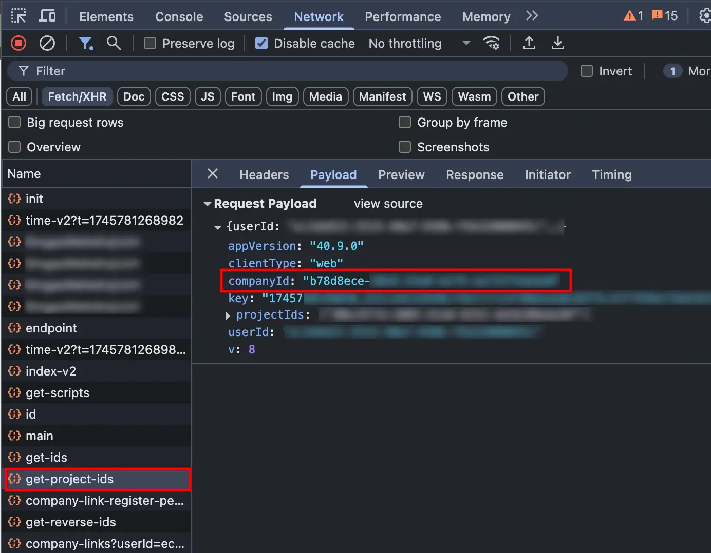

# YouGile Timetracking Bot

[](https://www.typescriptlang.org/) [](https://hub.docker.com/r/m4l3vich/yougile-timetracking-bot) [](https://standardjs.com) [](https://hub.docker.com/r/m4l3vich/yougile-timetracking-bot) [](https://puregram.cool)

[На русском](README.md)

This bot helps you generate reports based on your and other users' time tracking in YouGile.

https://github.com/user-attachments/assets/fa60ced2-550d-400e-8a62-42ac39a6f09e

## How does the report generating work?

The bot is creating the reports based on the hours value set in the "Spent time" field in "Time tracking" sticker in the tasks on the board in YouGile.

For example, let's assume you set 8 hours in the "Spent time" field. After that, someone else set 12 hours in the same field. The bot will report that you spent 8 hours on this task, and the other user spent 4 hours. If you add more hours, your time will increase etc.

All the data about spent time is shown on the "Event list" page in YouGile, and that's where the bot is taking all data for reports.

This bot was created exactly because the weird (_suboptimal_) time tracking implementation in YouGIle.

## Running using Docker (recommended)

`linux/amd64` and `linux/arm64` builds are available.

Create a file called `credentials.txt` and enter username and password to a YouGile user account, divided by `:`, for example: `user@example.com:somepassword`.

**Be sure to store the credentials file securely when using in a production enviroment.** You can use [Docker Compose secrets](https://docs.docker.com/compose/how-tos/use-secrets/) for this.

To start the bot, use this command:

```bash
docker run \
	--name yougile-bot \
  -v ./credentials.txt:/app/credentials.txt \
  m4l3vich/yougile-timetracking-bot
```

Required environment variables:

| Variable          | Description                                                  |
| ----------------- | ------------------------------------------------------------ |
| **TG_TOKEN**      | Telegram bot token. You can create a Telegram bot using [@BotFather](https://t.me/BotFather) |
| **YG_COMPANY_ID** | UUID of your company in YouGile **(read below)**             |

Optional environment variables:

- **TG_WHITELIST**: List of Telegram User ID's of users, split by comma, that will be allowed to use this bot.
  You can get your own user ID using [@myidbot](https://t.me/myidbot).
  Example value: `123456,7890`.
  If this is not set, everyone will be able to use the bot.
- **YG_API_URL**: URL for the YouGile's API server.
  In most cases, you don't need to set this variable.
  The default value is `https://an3-acc2.yougile.com`
- **YG_CREDENTIALS_FILE**: Path to YouGile user's credentials file.
  Default value: `./credentials.txt`

## Running locally

You will need latest [Node.js LTS](https://nodejs.org/en/download) and [PNPM](https://pnpm.io/installation).

1. Clone this repo: `git clone https://github.com/m4l3vich/yougile-timetracking-bot; cd yougile-timetracking-bot`
2. Install dependencies: `pnpm install`
3. Build the app: `pnpm build`
4. Create  `.env` file with all the environment variables
5. Create `credentials.txt` file with YouGile username and password
6. Run the app: `pnpm start` or `node build/index.js`

# How do I get YG_COMPANY_ID?

Unfortunately, this is not that easy.

1. Open YouGile in Chrome

2. Open DevTools (F12) -> Network tab

3. Select the "Fetch/XHR" filter

4. Refresh the page

5. Find a request that will contain `companyId` in its payload, for example:

   

6. Copy the value (without quotes!) and use it