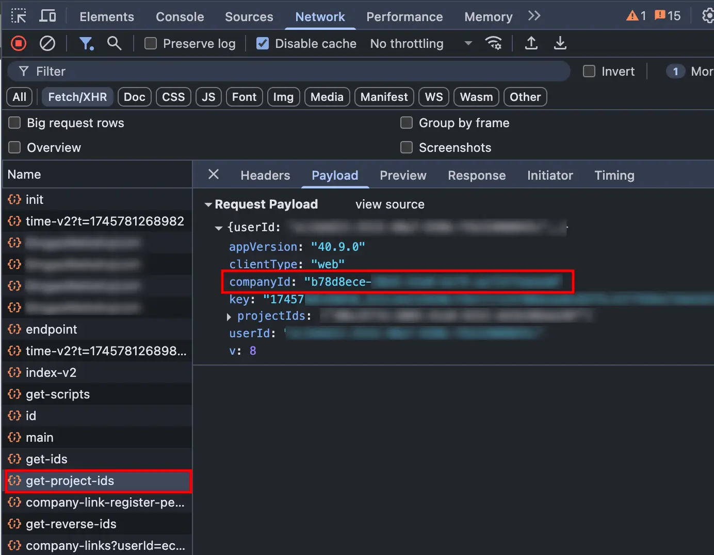

# YouGile Timetracking Bot

[](https://www.typescriptlang.org/) [](https://hub.docker.com/r/m4l3vich/yougile-timetracking-bot) [](https://standardjs.com) [](https://hub.docker.com/r/m4l3vich/yougile-timetracking-bot)

[English](README-EN.md)

Бот, который создает отчеты на основе таймтрекинга пользователей YouGile.

https://github.com/user-attachments/assets/fa60ced2-550d-400e-8a62-42ac39a6f09e

## Как работает создание отчётов?

Бот создаёт отчёты на основе часов, записанных пользователями в графу "Факт" в стикере "Таймтрекинг" в задачах на доске YouGile.

Например, вы записали 8 часов в графу "Факт". После этого, ваш коллега заменил значение на 12 часов. В итоге, бот считает, что по этой задаче вы записали 8 часов, а ваш коллега - 4 часа. Если вы после этого добавите еще часов, бот суммирует их вам и так далее.

Все данные о фактическом времени содержатся на странице "Лента событий" в YouGile, оттуда же бот берет данные для отчётов.

Этот бот был создан как раз из-за странной (_субоптимальной_) реализации таймтрекинга в YouGile.

## Развёртывание с помощью Docker (рекомендуется)

Доступны сборки для архитектур `linux/amd64` и `linux/arm64`.

Создайте файл `credentials.txt` и впишите туда логин и пароль от пользователя YouGile, разделенные двоеточием `:`, например: `user@example.com:somepassword`.

**В продакшн-среде этот файл необходимо хранить безопасно.** Например, можно использовать [секреты в Docker Compose](https://docs.docker.com/compose/how-tos/use-secrets/).

Чтобы запустить бота, используйте команду:

```bash
docker run \
  --name yougile-bot \
  -v ./credentials.txt:/app/credentials.txt \
  m4l3vich/yougile-timetracking-bot
```

Обязательные переменные окружения:

| Variable          | Description                                                  |
| ----------------- | ------------------------------------------------------------ |
| **TG_TOKEN**      | Токен бота Telegram. Бота можно создать с помощью [@BotFather](https://t.me/BotFather) |
| **YG_COMPANY_ID** | UUID компании в YouGile **(подробнее ниже)**                 |

Дополнительные переменные:

- **TG_WHITELIST**: Разделенный запятой список ID пользователей Telegram, которым будет доступен этот бот.
  Чтобы получить свой ID, можно использовать бота [@myidbot](https://t.me/myidbot).
  Пример значения: `123456,7890`.
  Если эта переменная не используется, бот будет доступен всем пользователям.
- **YG_API_URL**: URL сервера API YouGile.
  В большинстве случаев, эту переменную можно не задавать.
  Значение по умолчанию: `https://an3-acc2.yougile.com`
- **YG_CREDENTIALS_FILE**: Путь к файлу с логином и паролем от пользователя YouGile.
  Значение по умолчанию: `./credentials.txt`

## Запуск без Docker

Для этого потребуется последняя версия [Node.js LTS](https://nodejs.org/en/download) и менеджер пакетов [PNPM](https://pnpm.io/installation).

1. Скачайте репозиторий: `git clone https://github.com/m4l3vich/yougile-timetracking-bot; cd yougile-timetracking-bot`;
2. Установите зависимости: `pnpm install`;
3. Соберите приложение: `pnpm build`;
4. Создайте файл `.env` с переменными окружения;
5. Запустите бота: `pnpm start` или `node build/index.js`.

# Как получить значение YG_COMPANY_ID?

К сожалению, простого способа нет.

1. Откройте YouGile в браузере Chrome;
2. Откройте параметры разработчика (F12) -> вкладка Network (Сеть);
3. Выберите фильтр "Fetch/XHR";
4. Перезагрузите страницу
5. Найдите в списке запрос, в параметрах которого будет значение `companyId`, например:

   
6. Скопируйте значение (без кавычек!) и используйте его